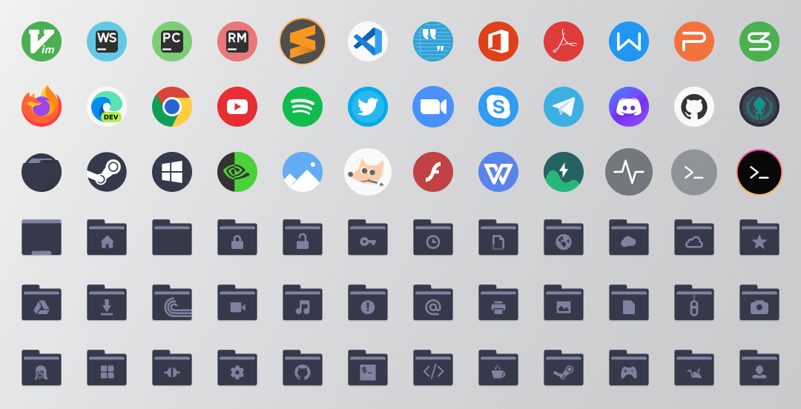

<h1 align="center">
  Dracula Icons
  <br>
</h1>

<p align="center">
  Dark icons theme for linux desktops
</p>

<p align="center">
  <a href="#install">Install</a> •
  <a href="#team">Team</a> •
  <a href="#license">License</a>
</p>


<i>See the <a href="https://github.com/m4thewz/dracula-icons/tree/circle">circle version</a></i>

## Donate
<a href="https://buymeacoffee.com/matheusvitor"></a>
## Install
#### With a terminal
```
git clone https://github.com/m4thewz/dracula-icons ~/.icons/dracula-icons
```
#### Manually
Download the repository content and move to `~/.icons` (create it if necessary). Or to `/usr/share/icons` if you want to add the theme for all users.

## Icon Sources
> The icons of this theme is from anothers sources, recolored based on [dracula pallete](https://draculatheme.com).

Apps, Mimetypes and Scalable Devices from [Tela-Circle-Icon](https://github.com/vinceliuice/Tela-circle-icon-theme). <br/>
Places, Actions and 16/22/24 Devices from [Papirus](https://github.com/PapirusDevelopmentTeam/papirus-icon-theme/).

## Team

[](https://github.com/m4thewz) | 
--- | 
[Matheus Vitor](https://github.com/m4thewz) | 

## License

[GPL-3.0 License](./LICENSE.md)
